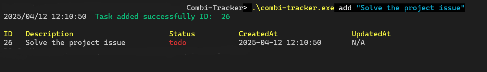
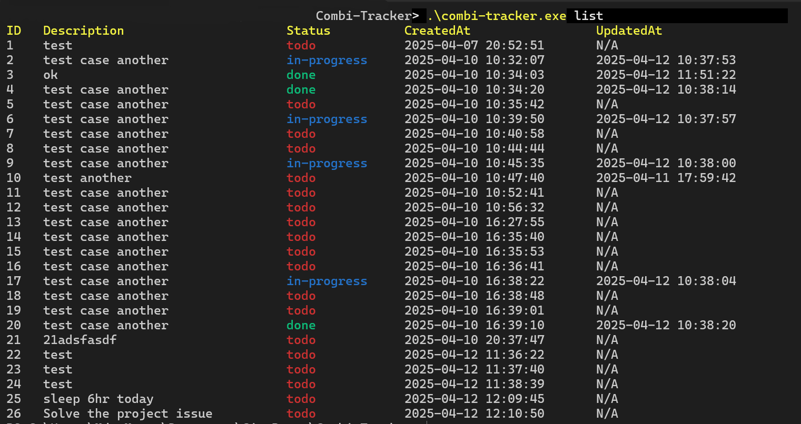
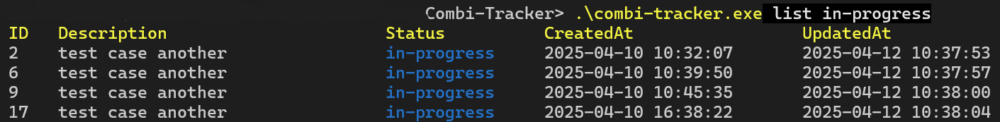

# COMBI-TRACKER

**Combi-Tracker** is a simple yet powerful CLI task manager written in Go. It lets you create, update, mark, delete, and list your tasks from the command line — perfect for developers and power users who live in the terminal.

---
---

- ✅ Add tasks with a single command
- 📝 Update task descriptions
- 📌 Mark tasks as `todo`, `in-progress`, or `done`
- 🗑️ Delete tasks
- 📋 List all tasks or filter by status
- 🎨 Color-coded output
- 🧠 Simple and fast with zero dependencies outside Go stdlib

---
---

## Some Image of Terminal Output




## 📦 Installation

Clone the repo and build it:
```bash
git clone https://github.com/munnaMia/Combi-Tracker.git
cd Combi-Tracker

# Windows
go build -o combi-tracker.exe

# Linux & macOS
go build -o combi-tracker
```


## 🛠️ Usage

### Add a task 
```bash
combi-tracker add "Buy groceries"
# Output: Task added successfully (ID: 1)
```
### Update a task
```bash
combi-tracker update 1 "Buy groceries and cook dinner"
```

### Delete a task
```bash
combi-tracker delete 1
```
### Mark a task as in-progress
```bash
combi-tracker mark-in-progress 1
```
### Mark a task as done
```bash
combi-tracker mark-done 1
```

### List all tasks and based on Status
```bash
combi-tracker list
combi-tracker list todo
combi-tracker list in-progress
combi-tracker list done
```

### Show help
```bash
combi-tracker help
```


---
## 🎨 Color Output
**Combi-Tracker** uses ANSI color codes to make CLI output easier to scan. Statuses are color-coded, and the help command highlights important parts for quick reading.


